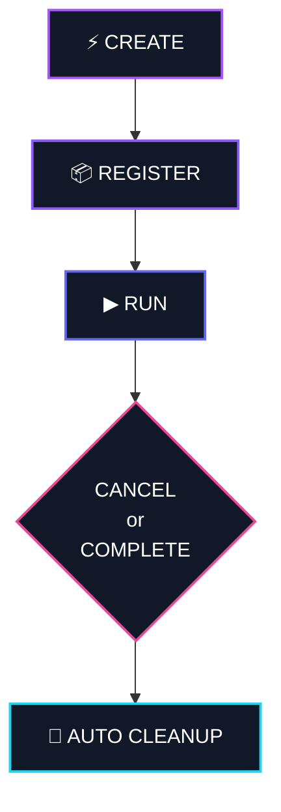
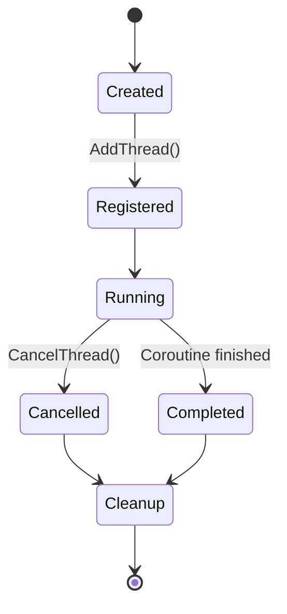
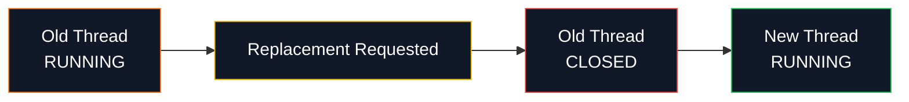
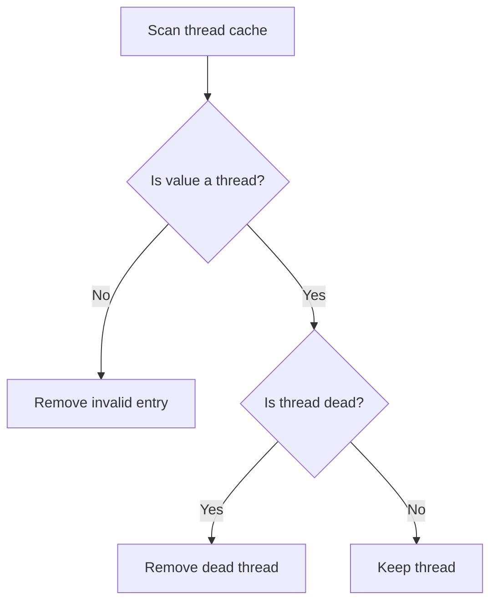
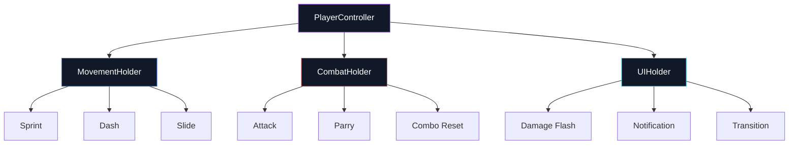
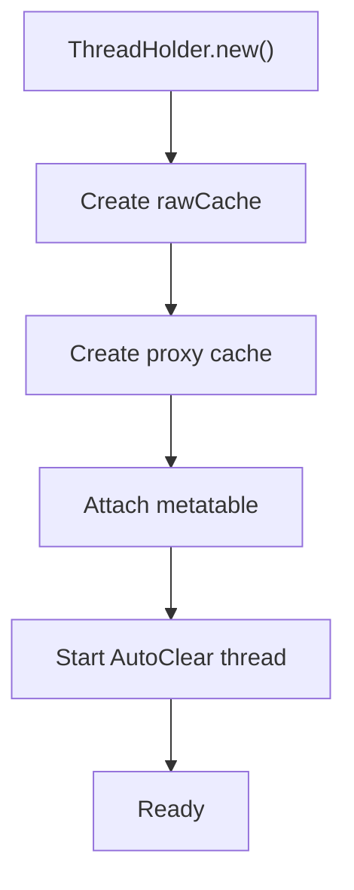
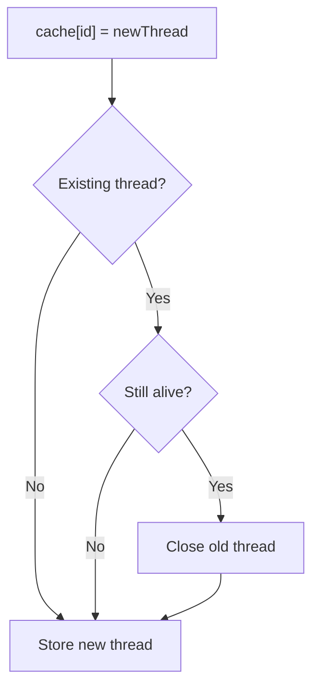

<div align="center">

# ⚡ MTH-Roblox

### Multi Thread Handler for Roblox

**A lightweight, typed, auto-cleaning thread lifecycle system for Luau.**

Manage asynchronous tasks without turning your codebase into a graveyard of forgotten coroutines.

<br/>


</div>

---

## ✦ What is MTH?

**MTH-Roblox** is a compact thread management system built for Roblox developers who want more control over asynchronous tasks.

Instead of scattering:

```luau id="kyy25z"
task.spawn()
task.defer()
coroutine.close()
```

throughout your project, MTH gives you a centralized thread lifecycle.



<div align="center">

### One holder.

### One source of truth.

### No orphaned threads.

</div>

---

## ✦ Why does this exist?

Async-heavy Roblox projects get messy fast.

You start with something harmless:

```luau id="55yx9f"
task.spawn(function()
	while true do
		task.wait()
	end
end)
```

Then more systems appear.

```text id="8mc8lo"
Combat
Movement
Abilities
NPC AI
UI
Animations
Timers
Effects
Cooldowns
Background loops
```

Eventually you ask:

```text id="09wqpi"
"Which thread is still running?"
```

or:

```text id="187ycz"
"Why did this task execute twice?"
```

or:

```text id="tsjnx7"
"Why is this old loop still alive?"
```

MTH exists to make that lifecycle explicit and manageable.

---

## ✦ Quick Start

```luau id="25o3xj"
local ThreadHolder = require(path.To.ThreadHolder)

local holder = ThreadHolder.new("Combat")

holder:AddThread("DashCooldown", task.spawn(function()
	task.wait(2)

	print("Dash ready!")
end))
```

Later:

```luau id="rrm4ft"
holder:CancelThread("DashCooldown")
```

Or destroy everything managed by the holder:

```luau id="brqpds"
holder:Destroy()
```

---

<details>
<summary><b>⚡ Open Thread Lifecycle</b></summary>

<br/>



</details>

---

## ✦ Core Features

```text id="qxskd9"
✓ Named thread registration
✓ Individual thread cancellation
✓ Cancel all managed threads
✓ Automatic dead-thread cleanup
✓ Optional thread replacement
✓ Typed Luau API
✓ Exposed cache for advanced usage
✓ Lightweight architecture
✓ No external dependencies
```

---

## ✦ Thread Replacement

MTH can safely replace existing thread entries.

Imagine an ability being triggered twice.

Without proper management:

```text id="sd4pmd"
Dash #1   ● running
Dash #2   ● running
Dash #3   ● running
```

With MTH:



This is especially useful for:

```text id="fpkfel"
Dash states
Ability cooldowns
Temporary movement states
Animation loops
UI transitions
Combat actions
NPC behaviors
```

---

## ✦ Automatic Cleanup

MTH can periodically inspect its cache and remove finished threads.

Before:

```text id="xydhdf"
ThreadHolder
│
├── JumpCooldown      [running]
├── DamageFlash       [dead]
├── DashEffect        [running]
├── NPCThinkLoop      [dead]
└── UITransition      [dead]
```

After auto cleanup:

```text id="8pqv8l"
ThreadHolder
│
├── JumpCooldown      [running]
└── DashEffect        [running]
```

No manual cleanup required.

---

<details>
<summary><b>🧹 How Auto Cleanup Works</b></summary>

<br/>

The holder periodically scans its internal cache.



The scan interval is controlled through:

```text id="w6dhnf"
AutoClear_Update_Time
```

Values below `1` are rejected to prevent excessive update load.

</details>

---

## ✦ Typed Luau

MTH includes Luau type definitions.

That means better autocomplete, cleaner APIs and safer development.

```luau id="id2mf5"
local holder = ThreadHolder.new()

holder:AddThread(...)
holder:CancelThread(...)
holder:CancelAllThreads()
holder:Destroy()
```

Available properties:

```luau id="zyozbp"
holder.isAutoClear
holder.isEmpty
```

---

## ✦ API

<details>
<summary><b>ThreadHolder.new()</b></summary>

<br/>

Creates a new ThreadHolder.

```luau id="28jlmi"
local holder = ThreadHolder.new()
```

You can also provide an ID:

```luau id="iwe6gt"
local holder = ThreadHolder.new("PlayerController")
```

If no ID is provided, MTH automatically generates one.

You may also disable automatic cleanup:

```luau id="7ruz7e"
local holder = ThreadHolder.new("PlayerController", true)
```

</details>

---

<details>
<summary><b>AddThread()</b></summary>

<br/>

Registers a thread using a string identifier.

```luau id="44twzb"
holder:AddThread("Dash", task.spawn(function()

	print("Dash started")

end))
```

</details>

---

<details>
<summary><b>CancelThread()</b></summary>

<br/>

Cancels a registered thread and removes it from the holder.

```luau id="wqxqtt"
holder:CancelThread("Dash")
```

</details>

---

<details>
<summary><b>RemoveThread()</b></summary>

<br/>

Removes a thread reference without explicitly cancelling it.

```luau id="7khtek"
holder:RemoveThread("Dash")
```

</details>

---

<details>
<summary><b>CancelAllThreads()</b></summary>

<br/>

Cancels every thread managed by the holder.

```luau id="c55133"
holder:CancelAllThreads()
```

Useful when destroying a system, changing states or resetting a controller.

</details>

---

<details>
<summary><b>GetAutoCache()</b></summary>

<br/>

Returns the managed cache.

```luau id="9zlzql"
local threads = holder:GetAutoCache()
```

Useful for debugging or advanced integrations.

</details>

---

<details>
<summary><b>Destroy()</b></summary>

<br/>

Completely destroys the holder.

```luau id="khbc1b"
holder:Destroy()
```

This:

```text id="a88tbu"
Stops auto cleanup
↓
Cancels managed threads
↓
Removes metatables
↓
Clears holder data
```

</details>

---

## ✦ Properties

### `isAutoClear`

Returns whether automatic cleanup is enabled.

```luau id="9577xq"
print(holder.isAutoClear)
```

---

### `isEmpty`

Returns whether the holder currently contains no managed threads.

```luau id="rj0vld"
if holder.isEmpty then
	print("Nothing is running")
end
```

---

## ✦ Configuration

MTH can be configured through Roblox attributes.

### `Overwrite_Old_Thread`

Controls whether an existing thread ID may be replaced.

```text id="5c0su3"
false
│
└─ Existing IDs are protected

true
│
└─ Existing thread may be replaced
```

---

### `AutoClear_Update_Time`

Controls how frequently the holder checks for completed threads.

```text id="0q1rfk"
Thread cache
    │
    ▼
Wait N seconds
    │
    ▼
Scan threads
    │
    ├─ dead → remove
    │
    └─ alive → keep
```

---

## ✦ Example Architecture

MTH works especially well when each game system owns its own holder.



This keeps asynchronous logic scoped to the system that owns it.

---

## ✦ Good Use Cases

| System        | Example                             |
| ------------- | ----------------------------------- |
| ⚔ Combat      | attack windows, combos, cooldowns   |
| 🏃 Movement   | sprint, dash, slide                 |
| 🧠 NPC AI     | thinking loops, temporary states    |
| ✨ Effects     | flashes, particles, delayed cleanup |
| 🖥 UI         | transitions, notifications          |
| 🪄 Abilities  | casting, cooldowns, effects         |
| ⏱ Timers      | temporary delayed actions           |
| 🎬 Animations | animation controllers and loops     |

---

## ✦ Project Structure

```text id="gdve37"
MTH-Roblox
│
├── Module
│   └── ThreadHolder.rbxmx
│
├── RawCode
│   ├── ThreadHolder.luau
│   └── Type.luau
│
└── README.md
```

### `Module`

Contains the ready-to-use Roblox module.

### `RawCode`

Contains the raw Luau implementation and type definitions.

---

## ✦ Internals

<details>
<summary><b>🔬 Show Internal Flow</b></summary>

<br/>



When assigning a new thread to the cache:



</details>

---

## ✦ Philosophy

MTH intentionally stays small.

It does not try to become a full scheduler.

It does not try to replace Roblox's task library.

It simply adds lifecycle management around threads.

```text id="lghl01"
Roblox task system
        +
MTH lifecycle management
        =
Predictable async behavior
```

---

<div align="center">

# ⚡ Small module.

# Clean lifecycle.

# Less async chaos.

<br/>

**Create. Register. Run. Clean.**

<br/>

`MTH-Roblox`

</div>
